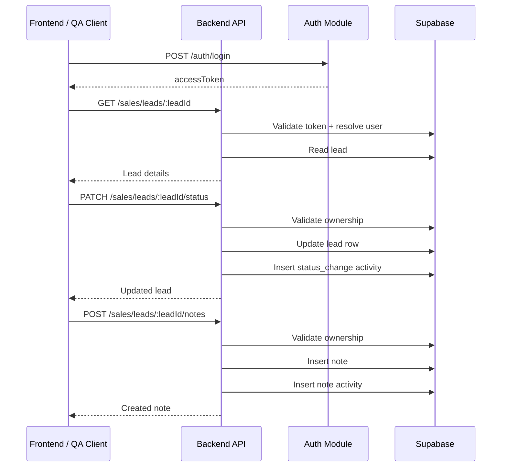
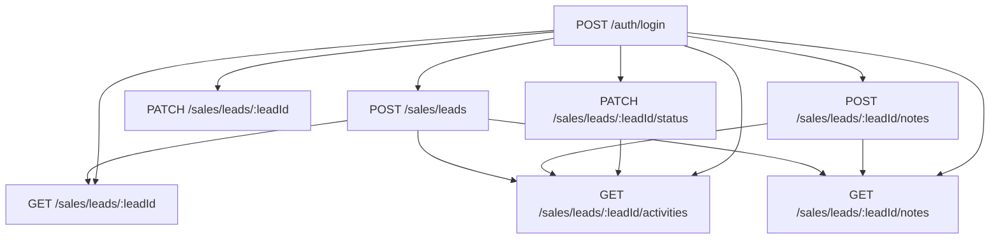

# Sales Leads API Documentation

This document describes the currently implemented Sales Leads backend APIs for GaadiWalo.

Target audience:

- Frontend Developers
- QA/Test Engineers

Source of truth:

- `apps/backend/src/modules/sales-leads/sales-leads.routes.ts`
- `apps/backend/src/modules/sales-leads/sales-leads.controller.ts`
- `apps/backend/src/modules/sales-leads/sales-leads.service.ts`
- `apps/backend/src/modules/sales-leads/sales-leads.types.ts`
- `apps/backend/src/common/utils/authenticated-user.ts`
- `apps/backend/src/common/utils/send-response.ts`
- `apps/backend/src/common/constants/lead.constants.ts`

## Overview

### Purpose of the APIs

These APIs support the Sales lead detail workflow in the backend. They allow a Sales user to:

- fetch all accessible Leads for the leads list
- fetch a single Lead and its detailed attributes
- fetch Lead activities
- fetch Lead notes
- update Lead status
- update Lead contact and vehicle preference details
- create a Lead note
- create a new Lead

### Business Use Case

These endpoints power the day-to-day Lead handling journey for dealership sales staff:

1. Open a Lead from the leads list.
2. Review Lead profile, notes, and activity timeline.
3. Update status after contact or discussion.
4. Add notes after calls or WhatsApp follow-ups.
5. Create a new Lead manually when received offline or through a direct walk-in/call.

### Related Modules / Features

- Sales leads listing and lead detail screens
- Lead notes and activity timeline
- Manual lead creation flow
- Sales authentication and access control

## Base Information

| Item | Value |
| --- | --- |
| Base route group | `/sales/leads` |
| API style | REST |
| Content-Type | `application/json` |
| Auth type | Bearer token |
| Backend framework | Hono |
| Standard response envelope | `data`, `status`, `status_code`, `message`, `error` |

### Base URL

The repository does not hardcode a single deployment host in documentation. Use the environment-specific backend host and append the endpoint paths from this document.

Examples:

- Local development: `http://localhost:8080` if `PORT` is not overridden
- UAT: use the deployed UAT backend host
- Production: use the deployed production backend host

### Environment Details

| Environment | Notes |
| --- | --- |
| Dev | Default backend port is `8080` when `PORT` is not set. |
| UAT | Hostname is deployment-specific and must be supplied by the environment owner. |
| Prod | Hostname is deployment-specific and must be supplied by the environment owner. |

### Authentication Mechanism

- All Sales Leads endpoints require `Authorization: Bearer <accessToken>`.
- The access token is obtained from `POST /auth/login`.
- The backend validates the bearer token with Supabase Auth, then resolves the internal user record.
- Access is available to Sales and Admin users.
- If the token is missing or invalid, the endpoint returns `401`.
- If the user is authenticated but does not have a supported role, the endpoint returns `403`.

### Required Headers

| Header | Required | Value |
| --- | --- | --- |
| `Authorization` | Yes | `Bearer <accessToken>` |
| `Content-Type` | Yes for `POST`/`PATCH` | `application/json` |

### Response Headers

| Header | Notes |
| --- | --- |
| `x-response-time-ms` | Added by middleware on all responses. Useful for QA timing checks and performance observation. |

## Common Response Envelope

### Success

```json
{
  "data": {},
  "status": "success",
  "status_code": 200,
  "message": "Human readable message",
  "error": null
}
```

### Error

```json
{
  "data": null,
  "status": "error",
  "status_code": 400,
  "message": "Human readable message",
  "error": "Error detail string"
}
```

## Endpoint Summary

| Endpoint | Method | Purpose |
| --- | --- | --- |
| `/sales/leads` | `GET` | Fetch all accessible Leads for the logged-in user |
| `/sales/leads/statuses` | `GET` | Fetch available Lead statuses for create/update dropdowns, including lost reason names for `LOST` |
| `/sales/leads/lead-sources` | `GET` | Fetch active Lead sources for lead create/edit dropdowns |
| `/sales/leads/branches` | `GET` | Fetch active branches for branch-selection dropdowns |
| `/sales/leads/car-brands` | `GET` | Fetch available car brands for Lead forms, including model names for each brand |
| `/sales/leads/car-brands/:carBrandName/car-models` | `GET` | Fetch available car models for the selected car brand |
| `/sales/leads/:leadId` | `GET` | Fetch one Lead with detail fields |
| `/sales/leads/:leadId/activities` | `GET` | Fetch Lead activity timeline |
| `/sales/leads/:leadId/notes` | `GET` | Fetch Lead notes |
| `/sales/leads/:leadId/status` | `PATCH` | Update Lead status |
| `/sales/leads/:leadId` | `PATCH` | Update Lead profile and preference fields |
| `/sales/leads/:leadId/notes` | `POST` | Create a new Lead note |
| `/sales/leads` | `POST` | Create a new Lead |

## Endpoint Details

## 1. Get All Leads

### Endpoint Name

| Item | Value |
| --- | --- |
| HTTP Method | `GET` |
| Endpoint URL | `/sales/leads` |
| Description | Returns all Leads accessible to the authenticated Sales or Admin user for the leads listing screen. |

### Request

#### Query Parameters

None.

#### Request Headers

| Header | Required | Description |
| --- | --- | --- |
| `Authorization` | Yes | Bearer access token from login. |

#### Request Body

None.

#### Sample Request

```http
GET /sales/leads HTTP/1.1
Authorization: Bearer <accessToken>
```

### Response

#### Success Response Schema

```ts
interface LeadListItemData {
  id: string;
  fullName: string;
  phone: string;
  email: string | null;
  source: string;
  status:
    | "NEW"
    | "CONTACTED"
    | "INTERESTED"
    | "TEST_DRIVE"
    | "NEGOTIATION"
    | "WON"
    | "LOST"
    | "VEHICLE_NA";
  carBrand: string | null;
  carModel: string | null;
  branchId: string | null;
  branchName: string | null;
  assignedTo: LeadUserSummaryData | null;
  createdAt: string | null;
  updatedAt: string | null;
}
```

## 1A. Get Lead Status Options

### Endpoint Name

| Item | Value |
| --- | --- |
| HTTP Method | `GET` |
| Endpoint URL | `/sales/leads/statuses` |
| Description | Returns the status options from the `statuses` table for Lead creation and status update dropdowns. The `reason` field is populated from the `lost_reasons.name` values for the `LOST` status. |

### Sample Success Response

```json
{
  "data": [
    {
      "id": "status-new",
      "name": "NEW",
      "reason": []
    },
    {
      "id": "status-contacted",
      "name": "CONTACTED",
      "reason": []
    },
    {
      "id": "status-lost",
      "name": "LOST",
      "reason": ["Budget issue", "Bought elsewhere"]
    }
  ],
  "status": "success",
  "status_code": 200,
  "message": "Lead statuses fetched successfully.",
  "error": null
}
```

## 1B. Get Lead Source Options

### Endpoint Name

| Item | Value |
| --- | --- |
| HTTP Method | `GET` |
| Endpoint URL | `/sales/leads/lead-sources` |
| Description | Returns active Lead sources from the `lead_sources` table for Lead create and edit dropdowns. Only rows where `is_active = true` are returned. |

### Sample Success Response

```json
{
  "data": [
    {
      "id": "source-1",
      "name": "CarWale",
      "description": "Marketplace lead source"
    },
    {
      "id": "source-2",
      "name": "Walk-in",
      "description": "Direct showroom visit"
    }
  ],
  "status": "success",
  "status_code": 200,
  "message": "Lead sources fetched successfully.",
  "error": null
}
```

## 1C. Get Branch Options

### Endpoint Name

| Item | Value |
| --- | --- |
| HTTP Method | `GET` |
| Endpoint URL | `/sales/leads/branches` |
| Description | Returns active branches from the `branches` table for branch-selection dropdowns. Only active rows are returned. |

### Success Response Schema

```ts
interface BranchOptionData {
  id: string;
  name: string;
}
```

### Sample Success Response

```json
{
  "data": [
    {
      "id": "branch-1",
      "name": "Calgary North"
    },
    {
      "id": "branch-2",
      "name": "Calgary South"
    }
  ],
  "status": "success",
  "status_code": 200,
  "message": "Branches fetched successfully.",
  "error": null
}
```

#### Sample Success Response

```json
{
  "data": [
    {
      "id": "lead-1",
      "fullName": "Rahul Sharma",
      "phone": "9876543210",
      "email": "rahul@example.com",
      "source": "CarWale",
      "status": "INTERESTED",
      "carBrand": "Hyundai",
      "carModel": "Creta",
      "branchId": "branch-1",
      "branchName": "Calgary North",
      "assignedTo": {
        "id": "sales-1",
        "name": "Neha Singh"
      },
      "createdAt": "2026-05-18T10:00:00.000Z",
      "updatedAt": "2026-05-18T12:00:00.000Z"
    }
  ],
  "status": "success",
  "status_code": 200,
  "message": "Leads fetched successfully.",
  "error": null
}
```

## 2. Get Lead Details

### Endpoint Name

| Item | Value |
| --- | --- |
| HTTP Method | `GET` |
| Endpoint URL | `/sales/leads/:leadId` |
| Description | Returns the complete Lead detail payload visible to the authorized Sales or Admin user. |

### Request

#### Path Parameters

| Field | Type | Required | Description | Validation |
| --- | --- | --- | --- | --- |
| `leadId` | `string` | Yes | Lead identifier from the route. | Must be a non-empty trimmed string. |

#### Query Parameters

None.

#### Request Headers

| Header | Required | Description |
| --- | --- | --- |
| `Authorization` | Yes | Bearer access token from login. |

#### Request Body

None.

#### Sample Request

```http
GET /sales/leads/lead-1 HTTP/1.1
Authorization: Bearer <accessToken>
```

### Response

#### Success Response Schema

```ts
interface LeadUserSummaryData {
  id: string;
  name: string;
}

interface LeadDetailsData {
  id: string;
  fullName: string;
  phone: string;
  email: string | null;
  source: string;
  status:
    | "NEW"
    | "CONTACTED"
    | "INTERESTED"
    | "TEST_DRIVE"
    | "NEGOTIATION"
    | "WON"
    | "LOST"
    | "VEHICLE_NA";
  lostReason: string | null;
  referrerName: string | null;
  referrerPhone: string | null;
  carBrand: string | null;
  carModel: string | null;
  variantName: string | null;
  colorPreference: string | null;
  budget: string | null;
  isUsed: boolean | null;
  branchId: string | null;
  branchName: string | null;
  assignedTo: LeadUserSummaryData | null;
  createdBy: LeadUserSummaryData | null;
  createdAt: string | null;
  updatedAt: string | null;
}
```

#### Response Field Descriptions

| Field | Type | Nullable | Description |
| --- | --- | --- | --- |
| `id` | `string` | No | Lead identifier. |
| `fullName` | `string` | No | Customer full name. |
| `phone` | `string` | No | Primary customer mobile number. |
| `email` | `string` | Yes | Customer email address. |
| `source` | `string` | No | Lead source label. |
| `status` | `enum` | No | Current Lead pipeline status. |
| `lostReason` | `string` | Yes | Reason captured when status is `LOST`. |
| `referrerName` | `string` | Yes | Referrer name if available. |
| `referrerPhone` | `string` | Yes | Referrer phone number if available. |
| `carBrand` | `string` | Yes | Interested vehicle brand. |
| `carModel` | `string` | Yes | Interested vehicle model. |
| `variantName` | `string` | Yes | Interested vehicle variant. |
| `colorPreference` | `string` | Yes | Preferred color. |
| `budget` | `string` | Yes | Budget display text. |
| `isUsed` | `boolean` | Yes | Whether the Lead is interested in a used vehicle. |
| `branchId` | `string` | Yes | Branch identifier of the currently assigned sales user. |
| `branchName` | `string` | Yes | Branch name resolved from `branchId`. |
| `assignedTo` | `object` | Yes | Assigned sales user summary. |
| `createdBy` | `object` | Yes | Lead creator summary. |
| `createdAt` | `string` | Yes | Lead creation timestamp in ISO-8601 format. |
| `updatedAt` | `string` | Yes | Last update timestamp in ISO-8601 format. |

#### Sample Success Response

```json
{
  "data": {
    "id": "lead-1",
    "fullName": "Rahul Sharma",
    "phone": "9876543210",
    "email": "rahul@example.com",
    "source": "CarWale",
    "status": "INTERESTED",
    "lostReason": null,
    "referrerName": "Amit Verma",
    "referrerPhone": "9988776655",
    "carBrand": "Hyundai",
    "carModel": "i10",
    "variantName": "Sportz",
    "colorPreference": "Red",
    "budget": "6-8 Lakh",
    "isUsed": true,
    "branchId": "branch-1",
    "branchName": "Calgary North",
    "assignedTo": {
      "id": "SP001",
      "name": "Sales Person"
    },
    "createdBy": {
      "id": "SP001",
      "name": "Sales Person"
    },
    "createdAt": "2026-05-15T10:00:00.000Z",
    "updatedAt": "2026-05-15T12:30:00.000Z"
  },
  "status": "success",
  "status_code": 200,
  "message": "Lead details fetched successfully.",
  "error": null
}
```

#### Sample Failure Responses

```json
{
  "data": null,
  "status": "error",
  "status_code": 403,
  "message": "You are not allowed to access this lead.",
  "error": "You are not allowed to access this lead."
}
```

```json
{
  "data": null,
  "status": "error",
  "status_code": 404,
  "message": "Lead not found.",
  "error": "Lead not found."
}
```

### Status Codes

| Code | Meaning |
| --- | --- |
| `200` | Lead fetched successfully |
| `401` | Missing or invalid bearer token |
| `403` | Authenticated user is not allowed to access this Lead |
| `404` | Lead not found |
| `500` | Unexpected server or downstream failure |

### Business Rules

- Access is allowed only if the authenticated Sales user matches `assigned_to` or `created_by` on the Lead.
- The service accepts either the internal user row id or the business user id as a valid ownership match.
- If related `assignedTo` or `createdBy` user records cannot be resolved, those nested fields may be `null`.

### Frontend Notes

- Treat nullable fields as normal output, not as API failure.
- Render unknown optional values as empty UI state, placeholders, or hidden rows as product requires.
- Timestamps are returned as ISO strings.
- No retry-specific logic is enforced by backend; use standard idempotent GET retry behavior on transient network failure.

### QA Test Scenarios

- Verify an assigned Sales user can fetch the Lead successfully.
- Verify the Lead creator can fetch the Lead successfully when not the assignee.
- Verify a different Sales user receives `403`.
- Verify an invalid token returns `401`.
- Verify a missing `leadId` route value is rejected at routing/validation boundaries.
- Verify a non-existent `leadId` returns `404`.
- Verify nullable fields such as `email`, `referrerPhone`, and `assignedTo` are handled correctly in the response.

## 3. Get Lead Activities

### Endpoint Name

| Item | Value |
| --- | --- |
| HTTP Method | `GET` |
| Endpoint URL | `/sales/leads/:leadId/activities` |
| Description | Returns the Lead activity ledger used for timeline/history views. |

### Request

#### Path Parameters

| Field | Type | Required | Description | Validation |
| --- | --- | --- | --- | --- |
| `leadId` | `string` | Yes | Lead identifier. | Must be a non-empty trimmed string. |

#### Query Parameters

None.

#### Request Headers

| Header | Required | Description |
| --- | --- | --- |
| `Authorization` | Yes | Bearer access token from login. |

#### Request Body

None.

#### Sample Request

```http
GET /sales/leads/lead-1/activities HTTP/1.1
Authorization: Bearer <accessToken>
```

### Response

#### Success Response Schema

```ts
interface LeadActivityData {
  id: string;
  leadId: string;
  type: "call" | "whatsapp" | "note" | "status_change" | "system";
  description: string;
  metaJson: Record<string, unknown> | null;
  createdAt: string | null;
}
```

#### Response Field Descriptions

| Field | Type | Nullable | Description |
| --- | --- | --- | --- |
| `id` | `string` | No | Activity identifier. |
| `leadId` | `string` | No | Owning Lead id. |
| `type` | `enum` | No | Activity classification. |
| `description` | `string` | No | Human-readable event description. |
| `metaJson` | `object` | Yes | Optional structured payload with extra details. |
| `createdAt` | `string` | Yes | ISO timestamp when the activity was created. |

#### Sample Success Response

```json
{
  "data": [
    {
      "id": "activity-2",
      "leadId": "lead-1",
      "type": "status_change",
      "description": "Lead status changed from NEW to CONTACTED.",
      "metaJson": {
        "previousStatus": "NEW",
        "nextStatus": "CONTACTED",
        "lostReason": null
      },
      "createdAt": "2026-05-15T11:00:00.000Z"
    },
    {
      "id": "activity-1",
      "leadId": "lead-1",
      "type": "system",
      "description": "Lead created.",
      "metaJson": {
        "createdBy": "SP001"
      },
      "createdAt": "2026-05-15T10:00:00.000Z"
    }
  ],
  "status": "success",
  "status_code": 200,
  "message": "Lead activities fetched successfully.",
  "error": null
}
```

#### Sample Failure Response

```json
{
  "data": null,
  "status": "error",
  "status_code": 403,
  "message": "You are not allowed to access this lead.",
  "error": "You are not allowed to access this lead."
}
```

### Status Codes

| Code | Meaning |
| --- | --- |
| `200` | Activity list fetched successfully |
| `401` | Missing or invalid bearer token |
| `403` | Authenticated user is not allowed to access this Lead |
| `404` | Lead not found |
| `500` | Unexpected server or downstream failure |

### Business Rules

- Access uses the same Lead ownership rule as Lead details.
- Activity records are returned in descending `created_at` order.
- The endpoint returns an empty array when the Lead has no activities.
- `metaJson` structure depends on the activity type.

### Frontend Notes

- No pagination, filtering, or sorting parameters are currently supported.
- Display the list in returned order; backend already sorts newest first.
- Frontend should not assume all activity types have the same `metaJson` shape.

### QA Test Scenarios

- Verify the newest activity appears first.
- Verify an empty list returns `200` with `data: []`.
- Verify a status update creates a `status_change` activity visible here.
- Verify note creation creates a `note` activity visible here.
- Verify unauthorized and forbidden responses match expected ownership behavior.

## 4. Get Lead Notes

### Endpoint Name

| Item | Value |
| --- | --- |
| HTTP Method | `GET` |
| Endpoint URL | `/sales/leads/:leadId/notes` |
| Description | Returns the note list associated with the Lead. |

### Request

#### Path Parameters

| Field | Type | Required | Description | Validation |
| --- | --- | --- | --- | --- |
| `leadId` | `string` | Yes | Lead identifier. | Must be a non-empty trimmed string. |

#### Query Parameters

None.

#### Request Headers

| Header | Required | Description |
| --- | --- | --- |
| `Authorization` | Yes | Bearer access token from login. |

#### Request Body

None.

#### Sample Request

```http
GET /sales/leads/lead-1/notes HTTP/1.1
Authorization: Bearer <accessToken>
```

### Response

#### Success Response Schema

```ts
interface LeadNoteData {
  id: string;
  leadId: string;
  author: {
    id: string;
    name: string;
  } | null;
  content: string;
  createdAt: string | null;
}
```

#### Response Field Descriptions

| Field | Type | Nullable | Description |
| --- | --- | --- | --- |
| `id` | `string` | No | Note identifier. |
| `leadId` | `string` | No | Owning Lead id. |
| `author` | `object` | Yes | Note author summary; may be `null` if author cannot be resolved. |
| `content` | `string` | No | Note text. |
| `createdAt` | `string` | Yes | ISO timestamp of note creation. |

#### Sample Success Response

```json
{
  "data": [
    {
      "id": "note-2",
      "leadId": "lead-1",
      "author": {
        "id": "SP001",
        "name": "Sales Person"
      },
      "content": "Customer asked for a callback after 6 PM.",
      "createdAt": "2026-05-15T16:15:00.000Z"
    }
  ],
  "status": "success",
  "status_code": 200,
  "message": "Lead notes fetched successfully.",
  "error": null
}
```

#### Sample Failure Response

```json
{
  "data": null,
  "status": "error",
  "status_code": 404,
  "message": "Lead not found.",
  "error": "Lead not found."
}
```

### Status Codes

| Code | Meaning |
| --- | --- |
| `200` | Note list fetched successfully |
| `401` | Missing or invalid bearer token |
| `403` | Authenticated user is not allowed to access this Lead |
| `404` | Lead not found |
| `500` | Unexpected server or downstream failure |

### Business Rules

- Access uses the same Lead ownership rule as other Lead detail APIs.
- Notes are returned in descending `created_at` order.
- The endpoint returns `[]` when no notes exist.

### Frontend Notes

- No pagination or server-side filtering is implemented.
- Use returned order directly for “latest first” note rendering.
- `author` may be `null`; do not hard-fail UI if author resolution is missing.

### QA Test Scenarios

- Verify notes are returned newest first.
- Verify empty notes list behavior.
- Verify the newly added note is visible after note creation.
- Verify access control and not-found behavior.

## 4. Update Lead Status

### Endpoint Name

| Item | Value |
| --- | --- |
| HTTP Method | `PATCH` |
| Endpoint URL | `/sales/leads/:leadId/status` |
| Description | Updates the Lead pipeline status and writes a status-change activity entry. |

### Request

#### Path Parameters

| Field | Type | Required | Description | Validation |
| --- | --- | --- | --- | --- |
| `leadId` | `string` | Yes | Lead identifier. | Must be a non-empty trimmed string. |

#### Query Parameters

None.

#### Request Headers

| Header | Required | Description |
| --- | --- | --- |
| `Authorization` | Yes | Bearer access token from login. |
| `Content-Type` | Yes | Must be `application/json`. |

#### Request Body Schema

```ts
interface UpdateLeadStatusRequestData {
  status:
    | "NEW"
    | "CONTACTED"
    | "INTERESTED"
    | "TEST_DRIVE"
    | "NEGOTIATION"
    | "WON"
    | "LOST"
    | "VEHICLE_NA";
  lostReason?: string | null;
}
```

#### Field-Level Descriptions and Validation Rules

| Field | Type | Required | Validation | Notes |
| --- | --- | --- | --- | --- |
| `status` | `enum` | Yes | Must be one of the allowed Lead status values. | Drives workflow state. |
| `lostReason` | `string \| null` | Conditional | Trimmed. Required when `status = LOST`. Must be absent, empty, or `null` for all non-`LOST` statuses. | Stored as `null` for non-`LOST` statuses. |

#### Validation Matrix

| `status` | `lostReason` | Result |
| --- | --- | --- |
| `LOST` | non-empty string | Valid |
| `LOST` | `null` / empty / omitted | Invalid |
| not `LOST` | omitted / `null` / empty string | Valid |
| not `LOST` | non-empty string | Invalid |

#### Sample Request Payload

```json
{
  "status": "LOST",
  "lostReason": "Customer purchased from another dealership."
}
```

### Response

#### Success Response Schema

Returns the same `LeadDetailsData` shape as `GET /sales/leads/:leadId`.

#### Sample Success Response

```json
{
  "data": {
    "id": "lead-1",
    "fullName": "Rahul Sharma",
    "phone": "9876543210",
    "email": "rahul@example.com",
    "source": "CarWale",
    "status": "LOST",
    "lostReason": "Customer purchased from another dealership.",
    "referrerName": null,
    "referrerPhone": null,
    "carBrand": "Hyundai",
    "carModel": "i10",
    "variantName": "Sportz",
    "colorPreference": "Red",
    "budget": "6-8 Lakh",
    "isUsed": true,
    "branchId": "branch-1",
    "branchName": "Calgary North",
    "assignedTo": {
      "id": "SP001",
      "name": "Sales Person"
    },
    "createdBy": {
      "id": "SP001",
      "name": "Sales Person"
    },
    "createdAt": "2026-05-15T10:00:00.000Z",
    "updatedAt": "2026-05-15T18:00:00.000Z"
  },
  "status": "success",
  "status_code": 200,
  "message": "Lead status updated successfully.",
  "error": null
}
```

#### Sample Failure Responses

```json
{
  "data": null,
  "status": "error",
  "status_code": 400,
  "message": "Invalid lead status update request.",
  "error": "[{\"code\":\"custom\",\"path\":[\"lostReason\"],\"message\":\"Lost reason is required when status is LOST.\"}]"
}
```

```json
{
  "data": null,
  "status": "error",
  "status_code": 401,
  "message": "Authentication is required to access this resource.",
  "error": "Authentication is required to access this resource."
}
```

### Status Codes

| Code | Meaning |
| --- | --- |
| `200` | Lead status updated successfully |
| `400` | Invalid JSON or invalid status payload |
| `401` | Missing or invalid bearer token |
| `403` | Authenticated user is not allowed to update this Lead |
| `404` | Lead not found |
| `500` | Unexpected server or downstream failure |

### Business Rules

- Status must be one of the supported Lead status enum values.
- A status update always attempts to create a `status_change` activity entry.
- Activity `metaJson` contains `previousStatus`, `nextStatus`, and `lostReason`.
- For non-`LOST` statuses, backend explicitly persists `lost_reason` as `null`.

### Frontend Notes

- Use the returned Lead object to refresh the detail page state.
- When changing away from `LOST`, clear any UI-only lost reason field before sending.
- Validation errors come back as `400` with Zod-generated details inside `error`.
- No optimistic state should be treated as final until the API responds, because activity creation is part of the same server workflow.

### QA Test Scenarios

- Update from `NEW` to `CONTACTED` with no `lostReason`.
- Update to `LOST` with a valid non-empty `lostReason`.
- Attempt `LOST` without `lostReason` and verify `400`.
- Attempt non-`LOST` status with a non-empty `lostReason` and verify `400`.
- Verify a corresponding `status_change` activity appears in the activities endpoint.
- Verify access control with unowned Leads and invalid tokens.
- Verify repeated rapid status updates preserve each final persisted status and create separate activity entries.

## 5. Update Lead Details

### Endpoint Name

| Item | Value |
| --- | --- |
| HTTP Method | `PATCH` |
| Endpoint URL | `/sales/leads/:leadId` |
| Description | Updates editable Lead profile, contact, referrer, and vehicle preference fields. |

### Request

#### Path Parameters

| Field | Type | Required | Description | Validation |
| --- | --- | --- | --- | --- |
| `leadId` | `string` | Yes | Lead identifier. | Must be a non-empty trimmed string. |

#### Query Parameters

None.

#### Request Headers

| Header | Required | Description |
| --- | --- | --- |
| `Authorization` | Yes | Bearer access token from login. |
| `Content-Type` | Yes | Must be `application/json`. |

#### Request Body Schema

```ts
interface UpdateLeadDetailsRequestData {
  fullName: string;
  phone: string;
  email: string | null;
  source: string;
  referrerName?: string | null;
  referrerPhone?: string | null;
  carBrand?: string | null;
  carModel?: string | null;
  variantName?: string | null;
  colorPreference?: string | null;
  budget?: string | null;
  isUsed?: boolean | null;
}
```

#### Field-Level Descriptions

| Field | Type | Required | Validation | Notes |
| --- | --- | --- | --- | --- |
| `fullName` | `string` | Yes | Trimmed, minimum 2 characters | Customer name |
| `phone` | `string` | Yes | Exactly 10 digits | Must be unique across Leads except the current Lead |
| `email` | `string \| null` | Yes | Valid email, empty string allowed and normalized to `null` | Customer email |
| `source` | `string` | Yes | Trimmed, minimum 1 character | Lead source |
| `referrerName` | `string \| null` | No | Trimmed, empty string normalized to `null` | Referrer name |
| `referrerPhone` | `string \| null` | No | Exactly 10 digits if provided; empty string normalized to `null` | Referrer phone |
| `carBrand` | `string \| null` | No | Trimmed, empty string normalized to `null` | Vehicle brand |
| `carModel` | `string \| null` | No | Trimmed, empty string normalized to `null` | Vehicle model |
| `variantName` | `string \| null` | No | Trimmed, empty string normalized to `null` | Vehicle variant |
| `colorPreference` | `string \| null` | No | Trimmed, empty string normalized to `null` | Preferred color |
| `budget` | `string \| null` | No | Trimmed, empty string normalized to `null` | Budget display text |
| `isUsed` | `boolean \| null` | No | Boolean or `null` | Used vehicle interest |

#### Sample Request Payload

```json
{
  "fullName": "Rahul Sharma",
  "phone": "9876543210",
  "email": "rahul@example.com",
  "source": "CarWale",
  "referrerName": "Amit Verma",
  "referrerPhone": "9988776655",
  "carBrand": "Hyundai",
  "carModel": "i10",
  "variantName": "Sportz",
  "colorPreference": "Red",
  "budget": "6-8 Lakh",
  "isUsed": true
}
```

### Response

#### Success Response Schema

Returns the same `LeadDetailsData` shape as `GET /sales/leads/:leadId`.

#### Sample Success Response

```json
{
  "data": {
    "id": "lead-1",
    "fullName": "Rahul Sharma",
    "phone": "9876543210",
    "email": "rahul.updated@example.com",
    "source": "Walk-in",
    "status": "INTERESTED",
    "lostReason": null,
    "referrerName": "Amit Verma",
    "referrerPhone": "9988776655",
    "carBrand": "Hyundai",
    "carModel": "Creta",
    "variantName": "SX",
    "colorPreference": "White",
    "budget": "10-12 Lakh",
    "isUsed": false,
    "branchId": "branch-1",
    "branchName": "Calgary North",
    "assignedTo": {
      "id": "SP001",
      "name": "Sales Person"
    },
    "createdBy": {
      "id": "SP001",
      "name": "Sales Person"
    },
    "createdAt": "2026-05-15T10:00:00.000Z",
    "updatedAt": "2026-05-15T18:30:00.000Z"
  },
  "status": "success",
  "status_code": 200,
  "message": "Lead details updated successfully.",
  "error": null
}
```

#### Sample Failure Responses

Duplicate phone conflict:

```json
{
  "data": null,
  "status": "error",
  "status_code": 409,
  "message": "A lead with this phone number already exists.",
  "error": "A lead with this phone number already exists."
}
```

Validation error:

```json
{
  "data": null,
  "status": "error",
  "status_code": 400,
  "message": "Invalid lead details update request.",
  "error": "[{\"validation\":\"regex\",\"code\":\"invalid_string\",\"message\":\"Phone number must be 10 digits.\",\"path\":[\"phone\"]}]"
}
```

### Status Codes

| Code | Meaning |
| --- | --- |
| `200` | Lead details updated successfully |
| `400` | Invalid JSON or invalid request payload |
| `401` | Missing or invalid bearer token |
| `403` | Authenticated user is not allowed to update this Lead |
| `404` | Lead not found |
| `409` | Another Lead already uses the same phone number |
| `500` | Unexpected server or downstream failure |

### Business Rules

- Phone number uniqueness is enforced before update.
- The current Lead is allowed to retain its own existing phone number.
- Empty string inputs for optional string fields are normalized to `null`.
- No activity record is created for general Lead detail edits in the current implementation.

### Frontend Notes

- This endpoint behaves like a full editable detail payload, not a partial patch. Send all required fields.
- Do not assume backend preserves omitted required fields; frontend should send the full form state.
- Treat `409` as a user-correctable business conflict and surface it inline on the phone field or form banner.

### QA Test Scenarios

- Update all editable fields with valid values.
- Submit empty strings for optional fields and verify they come back as `null`.
- Submit an invalid email and verify `400`.
- Submit a short name and verify `400`.
- Submit a non-10-digit phone and verify `400`.
- Submit a duplicate phone used by another Lead and verify `409`.
- Verify no new activity entry is created for a pure detail update.

## 6. Create Lead Note

### Endpoint Name

| Item | Value |
| --- | --- |
| HTTP Method | `POST` |
| Endpoint URL | `/sales/leads/:leadId/notes` |
| Description | Creates a note for the Lead and also creates a `note` activity entry. |

### Request

#### Path Parameters

| Field | Type | Required | Description | Validation |
| --- | --- | --- | --- | --- |
| `leadId` | `string` | Yes | Lead identifier. | Must be a non-empty trimmed string. |

#### Query Parameters

None.

#### Request Headers

| Header | Required | Description |
| --- | --- | --- |
| `Authorization` | Yes | Bearer access token from login. |
| `Content-Type` | Yes | Must be `application/json`. |

#### Request Body Schema

```ts
interface CreateLeadNoteRequestData {
  content: string;
}
```

#### Field-Level Descriptions

| Field | Type | Required | Validation | Notes |
| --- | --- | --- | --- | --- |
| `content` | `string` | Yes | Trimmed, min 1, max 2000 characters | Empty or whitespace-only note is invalid |

#### Sample Request Payload

```json
{
  "content": "Customer asked for a callback after 6 PM."
}
```

### Response

#### Success Response Schema

```ts
interface LeadNoteData {
  id: string;
  leadId: string;
  author: {
    id: string;
    name: string;
  } | null;
  content: string;
  createdAt: string | null;
}
```

#### Sample Success Response

```json
{
  "data": {
    "id": "note-7",
    "leadId": "lead-1",
    "author": {
      "id": "SP001",
      "name": "Sales Person"
    },
    "content": "Customer asked for a callback after 6 PM.",
    "createdAt": "2026-05-15T16:15:00.000Z"
  },
  "status": "success",
  "status_code": 201,
  "message": "Lead note created successfully.",
  "error": null
}
```

#### Sample Failure Response

```json
{
  "data": null,
  "status": "error",
  "status_code": 400,
  "message": "Invalid create lead note request.",
  "error": "[{\"code\":\"too_small\",\"minimum\":1,\"type\":\"string\",\"inclusive\":true,\"exact\":false,\"message\":\"String must contain at least 1 character(s)\",\"path\":[\"content\"]}]"
}
```

### Status Codes

| Code | Meaning |
| --- | --- |
| `201` | Lead note created successfully |
| `400` | Invalid JSON or invalid note payload |
| `401` | Missing or invalid bearer token |
| `403` | Authenticated user is not allowed to update this Lead |
| `404` | Lead not found |
| `500` | Unexpected server or downstream failure |

### Business Rules

- A successful note create attempts two writes:
  1. insert into `lead_notes`
  2. insert a `note` activity into `lead_activities`
- The returned author object is built from the authenticated user context.
- Activity description is fixed as `A note was added to the Lead.`

### Frontend Notes

- On success, refresh both Notes and Activities panels if they are displayed separately.
- Because the backend performs a second write for the activity log, avoid assuming the note timeline is fully updated until the API completes.
- Whitespace-only content fails validation after trimming.

### QA Test Scenarios

- Create a valid note and verify `201`.
- Create a max-length note near 2000 characters.
- Create a note over 2000 characters and verify `400`.
- Create a whitespace-only note and verify `400`.
- Verify the note appears in `GET /notes`.
- Verify a matching `note` activity appears in `GET /activities`.
- Verify unauthorized, forbidden, and not-found cases.

## 7. Create Lead

### Endpoint Name

| Item | Value |
| --- | --- |
| HTTP Method | `POST` |
| Endpoint URL | `/sales/leads` |
| Description | Creates a new Lead assigned to the authenticated Sales user and optionally creates an initial note. |

### Request

#### Path Parameters

None.

#### Query Parameters

None.

#### Request Headers

| Header | Required | Description |
| --- | --- | --- |
| `Authorization` | Yes | Bearer access token from login. |
| `Content-Type` | Yes | Must be `application/json`. |

#### Request Body Schema

```ts
interface CreateLeadRequestData {
  fullName: string;
  phone: string;
  email: string | null;
  source: string;
  status?: "NEW" | "CONTACTED" | "INTERESTED" | "TEST_DRIVE" | "NEGOTIATION" | "WON" | "LOST" | "VEHICLE_NA";
  lostReason?: string | null;
  referrerName?: string | null;
  referrerPhone?: string | null;
  carBrand?: string | null;
  carModel?: string | null;
  variantName?: string | null;
  colorPreference?: string | null;
  budget?: string | null;
  isUsed?: boolean | null;
  initialNote?: string | null;
}
```

#### Field-Level Descriptions

| Field | Type | Required | Validation | Notes |
| --- | --- | --- | --- | --- |
| `fullName` | `string` | Yes | Trimmed, minimum 2 characters | Customer name |
| `phone` | `string` | Yes | Exactly 10 digits | Must be unique across Leads |
| `email` | `string \| null` | Yes | Valid email, empty string normalized to `null` | Customer email |
| `source` | `string` | Yes | Trimmed, minimum 1 character | Lead source |
| `status` | `LeadStatusData` | No | Valid status enum, defaults to `NEW` | Selected value should come from `GET /sales/leads/statuses` |
| `lostReason` | `string \| null` | No | Required when `status = LOST`; otherwise must be omitted or `null` | Selected value should come from the `reason` array in `GET /sales/leads/statuses` |
| `referrerName` | `string \| null` | No | Trimmed, empty string normalized to `null` | Referrer name |
| `referrerPhone` | `string \| null` | No | Exactly 10 digits if provided | Referrer phone |
| `carBrand` | `string \| null` | No | Trimmed, empty string normalized to `null` | Vehicle brand |
| `carModel` | `string \| null` | No | Trimmed, empty string normalized to `null` | Vehicle model. Requires `carBrand` and must belong to that brand |
| `variantName` | `string \| null` | No | Trimmed, empty string normalized to `null` | Vehicle variant |
| `colorPreference` | `string \| null` | No | Trimmed, empty string normalized to `null` | Preferred color |
| `budget` | `string \| null` | No | Trimmed, empty string normalized to `null` | Budget display text |
| `isUsed` | `boolean \| null` | No | Boolean or `null` | Used vehicle interest |
| `initialNote` | `string \| null` | No | Trimmed, empty string normalized to `null` | If present, creates a note and a note activity |

#### Sample Request Payload

```json
{
  "fullName": "Rahul Sharma",
  "phone": "9876543210",
  "email": "rahul@example.com",
  "source": "CarWale",
  "status": "CONTACTED",
  "referrerName": "Amit Verma",
  "referrerPhone": "9988776655",
  "carBrand": "Hyundai",
  "carModel": "i10",
  "variantName": "Sportz",
  "colorPreference": "Red",
  "budget": "6-8 Lakh",
  "isUsed": true,
  "initialNote": "Interested in a weekend showroom visit."
}
```

#### Vehicle Catalog Endpoints For Dropdowns

- Use `GET /sales/leads/statuses` to populate the Status dropdown.
- Use the `reason` array from the `LOST` item in `GET /sales/leads/statuses` to populate the Lost Reason dropdown.
- Use `GET /sales/leads/car-brands` to populate the Car Brand dropdown and read the nested `models` array for each brand.
- `GET /sales/leads/car-brands/:carBrandName/car-models` is still available when the frontend wants to fetch models separately after Brand selection.
- The create-lead payload accepts `status`, `lostReason`, `carBrand`, and `carModel` as display names.

### Response

#### Success Response Schema

```ts
interface CreateLeadResponseData {
  lead: LeadDetailsData;
  note: LeadNoteData | null;
}
```

#### Sample Success Response

```json
{
  "data": {
    "lead": {
      "id": "lead-created",
      "fullName": "Rahul Sharma",
      "phone": "9876543210",
      "email": "rahul@example.com",
      "source": "CarWale",
      "status": "NEW",
      "lostReason": null,
      "referrerName": "Amit Verma",
      "referrerPhone": "9988776655",
      "carBrand": "Hyundai",
      "carModel": "i10",
      "variantName": "Sportz",
      "colorPreference": "Red",
      "budget": "6-8 Lakh",
      "isUsed": true,
      "branchId": "branch-1",
      "branchName": "Calgary North",
      "assignedTo": {
        "id": "SP001",
        "name": "Sales Person"
      },
      "createdBy": {
        "id": "SP001",
        "name": "Sales Person"
      },
      "createdAt": "2026-05-15T10:00:00.000Z",
      "updatedAt": "2026-05-15T10:00:00.000Z"
    },
    "note": {
      "id": "note-1",
      "leadId": "lead-created",
      "author": {
        "id": "SP001",
        "name": "Sales Person"
      },
      "content": "Interested in a weekend showroom visit.",
      "createdAt": "2026-05-15T10:30:00.000Z"
    }
  },
  "status": "success",
  "status_code": 201,
  "message": "Lead created successfully.",
  "error": null
}
```

#### Sample Failure Response

```json
{
  "data": null,
  "status": "error",
  "status_code": 409,
  "message": "A lead with this phone number already exists.",
  "error": "A lead with this phone number already exists."
}
```

### Status Codes

| Code | Meaning |
| --- | --- |
| `201` | Lead created successfully |
| `400` | Invalid JSON or invalid create payload |
| `401` | Missing or invalid bearer token |
| `403` | Authenticated user is not allowed to create Leads |
| `409` | Another Lead already uses the same phone number |
| `500` | Unexpected server or downstream failure |

### Business Rules

- New Leads default to `status = NEW` when the frontend does not send `status`.
- If the frontend sends `status`, backend resolves the matching `status_id` from the `statuses` table and stores it on create.
- If `status = LOST`, frontend must also send a valid `lostReason` name and backend resolves the matching `lost_reason_id`.
- `assigned_to` and `created_by` are both set to the authenticated Sales user's internal record id.
- Phone number uniqueness is enforced before insert.
- A successful Lead create always attempts to create a `system` activity with description `Lead created.`
- If `initialNote` is present after trimming, backend also:
  1. inserts a note
  2. inserts a `note` activity
- If `initialNote` is omitted, empty, or whitespace-only, no note is created and response `data.note` is `null`.

### Frontend Notes

- Send the selected status name from `GET /sales/leads/statuses` when the create form includes a status dropdown.
- Send `lostReason` only when the selected status is `LOST`.
- Do not send `assignedTo` or `createdBy`; backend derives them.
- Use returned `data.lead.id` for post-create navigation.
- Handle `data.note` as nullable.
- On create success, the frontend can immediately hydrate the detail page from the returned `lead` object instead of forcing a refetch.

### QA Test Scenarios

- Create a Lead with all valid fields and no `initialNote`.
- Create a Lead with valid `initialNote` and verify both note and activity creation.
- Create a Lead with empty-string optional fields and verify normalization to `null`.
- Attempt duplicate phone and verify `409`.
- Attempt invalid email, invalid phone, or invalid referrer phone and verify `400`.
- Verify created Lead is assigned to and created by the authenticated Sales user.
- Verify omitted `status` defaults to `NEW`.
- Verify selected `status` is stored when sent during create.
- Verify `status = LOST` requires a valid `lostReason`.
- Verify concurrent duplicate create attempts for the same phone do not create two valid Leads.

## Authentication & Authorization

### Token Generation Flow

1. Call `POST /auth/login` with `userId` and `password`.
2. Read `data.accessToken` from the success response.
3. Send the access token in the `Authorization` header for Sales Leads APIs.
4. The authenticated user must have either the `sales` or `admin` role.

Example:

```http
Authorization: Bearer eyJhbGciOi...
```

### Token Refresh Flow

- Refresh-token lifecycle exists in the auth response shape, but a dedicated refresh endpoint is not documented or implemented for current Sales Leads usage.
- Frontend should treat refresh behavior as not available in the current backend phase unless a separate auth enhancement is delivered.
- On token expiry or auth failure, current expected behavior is re-authentication via login.

### Role-Based Access Rules

| Rule | Behavior |
| --- | --- |
| Missing bearer token | `401` |
| Invalid bearer token | `401` |
| Authenticated non-Sales user | `403` |
| Sales user with no ownership of target Lead | `403` |
| Sales user owns Lead via `assigned_to` | Allowed |
| Sales user owns Lead via `created_by` | Allowed |

### Permission Matrix

| Endpoint | Sales user owning Lead | Sales user not owning Lead | Non-Sales user | Unauthenticated |
| --- | --- | --- | --- | --- |
| `GET /sales/leads/:leadId` | Allowed | `403` | `403` | `401` |
| `GET /sales/leads/:leadId/activities` | Allowed | `403` | `403` | `401` |
| `GET /sales/leads/:leadId/notes` | Allowed | `403` | `403` | `401` |
| `PATCH /sales/leads/:leadId/status` | Allowed | `403` | `403` | `401` |
| `PATCH /sales/leads/:leadId` | Allowed | `403` | `403` | `401` |
| `POST /sales/leads/:leadId/notes` | Allowed | `403` | `403` | `401` |
| `POST /sales/leads` | Allowed | Allowed | `403` | `401` |

## Common Error Format

### Standard Error Structure

```json
{
  "data": null,
  "status": "error",
  "status_code": 400,
  "message": "Human readable message",
  "error": "Error detail string"
}
```

### Common Error Examples

Invalid JSON:

```json
{
  "data": null,
  "status": "error",
  "status_code": 400,
  "message": "Invalid request body.",
  "error": "Request body must be valid JSON."
}
```

Unauthorized:

```json
{
  "data": null,
  "status": "error",
  "status_code": 401,
  "message": "Authentication is required to access this resource.",
  "error": "Authentication is required to access this resource."
}
```

Conflict:

```json
{
  "data": null,
  "status": "error",
  "status_code": 409,
  "message": "A lead with this phone number already exists.",
  "error": "A lead with this phone number already exists."
}
```

## API Sequence Flows

### Lead Detail Page Load

1. Login via `POST /auth/login`.
2. Load `GET /sales/leads/:leadId`.
3. Load `GET /sales/leads/:leadId/activities`.
4. Load `GET /sales/leads/:leadId/notes`.

### Update Lead Status Flow

1. Submit `PATCH /sales/leads/:leadId/status`.
2. Backend updates the Lead row.
3. Backend creates a `status_change` activity row.
4. Frontend refreshes Lead details and/or activity timeline if needed.

### Add Note Flow

1. Submit `POST /sales/leads/:leadId/notes`.
2. Backend creates the note row.
3. Backend creates the `note` activity row.
4. Frontend refreshes Notes and Activities.

### Create Lead Flow

1. Submit `POST /sales/leads`.
2. Backend validates uniqueness by phone.
3. Backend creates the Lead with status `NEW`.
4. Backend creates a `system` activity row.
5. If `initialNote` exists, backend creates a note row.
6. If `initialNote` exists, backend creates a `note` activity row.
7. Frontend navigates to or hydrates the Lead detail view.

### Sequence Diagram



### API Dependency Chart



## Request / Response Mapping Tables

### Lead Details Mapping

| API Field | Source / Behavior |
| --- | --- |
| `fullName` | `leads.full_name` |
| `phone` | `leads.phone` |
| `email` | `leads.email` |
| `source` | `leads.source` |
| `status` | `leads.status` |
| `lostReason` | `leads.lost_reason` if present |
| `referrerName` | `leads.referrer_name` if present |
| `referrerPhone` | `leads.referrer_phone` if present |
| `carBrand` | `leads.car_brand` or fallback-compatible source column |
| `carModel` | `leads.car_model` or fallback-compatible source column |
| `branchId` | `users.branch_id` from the currently assigned sales user if available |
| `branchName` | Resolved from `branches.name` using `branchId` |
| `variantName` | `leads.variant_name` |
| `colorPreference` | `leads.color_preference` |
| `budget` | `leads.budget` |
| `isUsed` | `leads.is_used` |
| `assignedTo` | Resolved from `assigned_to` user record |
| `createdBy` | Resolved from `created_by` user record |

### Note Response Mapping

| API Field | Source / Behavior |
| --- | --- |
| `author.id` | Authenticated user's business user id for create response; resolved user id for fetch response |
| `author.name` | Authenticated user's full name for create response; resolved user name for fetch response |
| `content` | `lead_notes.content` |
| `createdAt` | `lead_notes.created_at` |

## Validation Matrix

### Route and Payload Validation Summary

| Endpoint | Validation |
| --- | --- |
| `GET /sales/leads/car-brands/:carBrandName/car-models` | `carBrandName` must be a non-empty trimmed string |
| All `:leadId` endpoints | `leadId` must be a non-empty trimmed string |
| `PATCH /:leadId/status` | `status` enum required; `lostReason` conditional |
| `PATCH /:leadId` | Required `fullName`, `phone`, `email`, `source`; optional normalized fields; `carModel` requires `carBrand` |
| `POST /:leadId/notes` | `content` required, trimmed, max 2000 |
| `POST /sales/leads` | Same validation as update details plus optional `status`, conditional `lostReason`, and optional `initialNote`; `carModel` must belong to `carBrand` |

## Postman / Swagger References

- No Swagger/OpenAPI document is present in the current repository state.
- No Postman collection is committed in the current repository state.
- Recommended QA setup:
  1. Login with `POST /auth/login`
  2. Copy `data.accessToken`
  3. Reuse the bearer token for the Sales Leads requests in this document

## Assumptions & Limitations

- This document covers the currently implemented Sales Leads detail APIs only, not every backend module.
- These APIs are primarily used in the Sales flow, but authenticated Admin users are also allowed to access them.
- No server-side pagination, sorting input, or filters are implemented for activities and notes.
- `leadId` format is not constrained to UUID at validation level; only non-empty string is enforced.
- Validation error detail strings are generated by Zod and may be verbose.
- The service performs multi-step writes for status updates, note creation, and lead creation without an explicit transaction layer in the current implementation.
- Because there is no explicit transaction, partial-write edge cases are possible if the Lead row is written successfully but a later activity/note write fails.
- Refresh-token usage for protected Sales Leads sessions is not implemented as a dedicated public API in the current phase.

## Appendix

### Enum Definitions

#### Lead Status Values

| Value | Meaning |
| --- | --- |
| `NEW` | Newly created or newly received Lead |
| `CONTACTED` | First contact made |
| `INTERESTED` | Positive interest shown |
| `TEST_DRIVE` | Test drive stage |
| `NEGOTIATION` | Pricing or offer discussion |
| `WON` | Successfully converted |
| `LOST` | Not converted |
| `VEHICLE_NA` | Vehicle unavailable or related availability block |

#### Lead Activity Types

| Value | Meaning |
| --- | --- |
| `call` | Call activity |
| `whatsapp` | WhatsApp activity |
| `note` | Note creation activity |
| `status_change` | Status transition activity |
| `system` | System-generated event |

### Important Constants

| Constant | Current Value |
| --- | --- |
| Lead unauthorized message | `Authentication is required to access this resource.` |
| Lead forbidden message | `You are not allowed to access this lead.` |
| Duplicate phone message | `A lead with this phone number already exists.` |
| Lead created activity description | `Lead created.` |
| Lead note activity description | `A note was added to the Lead.` |

### Sample IDs

| Field | Sample |
| --- | --- |
| Lead id | `lead-1` |
| Sales user id | `SP001` |
| Internal user record id | `user-row-1` |
| Note id | `note-1` |
| Activity id | `activity-1` |
